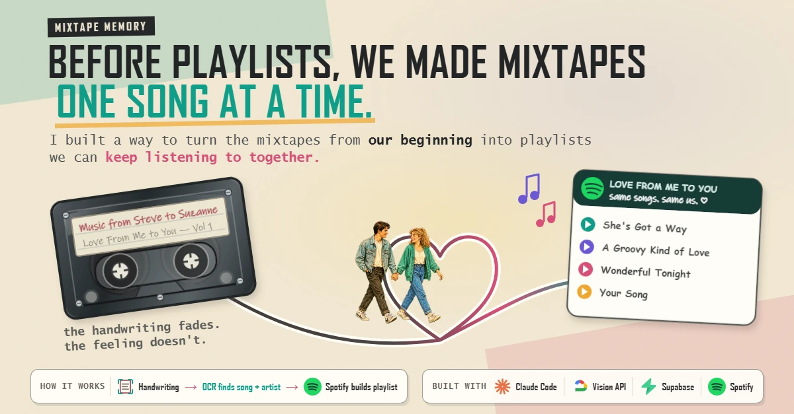
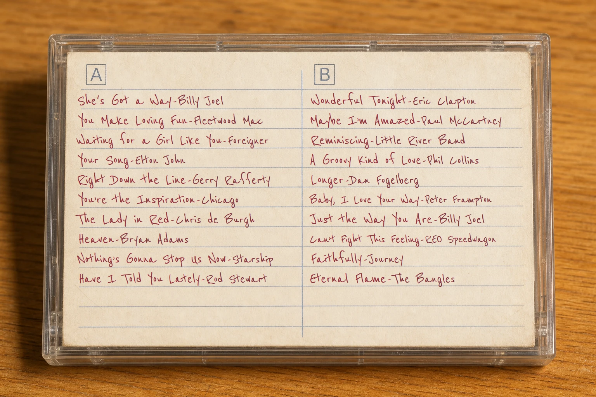
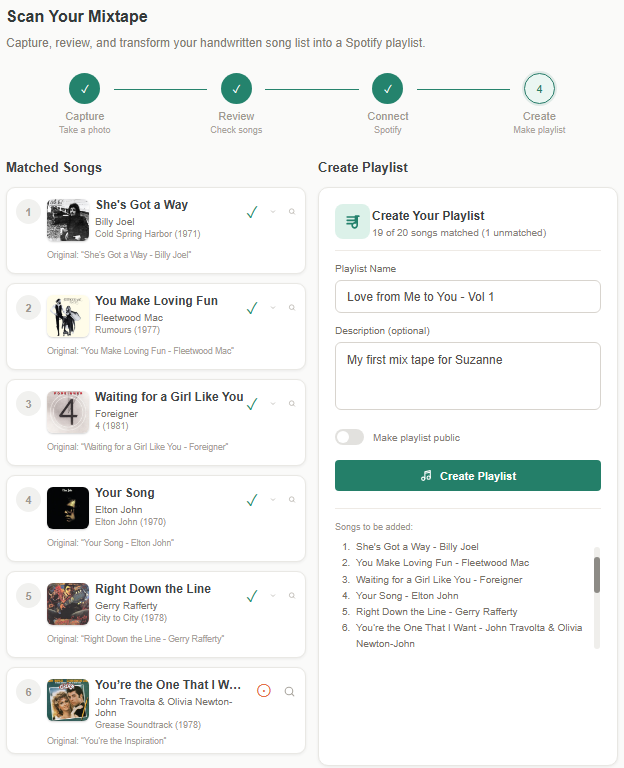

# Mixtape Memory



Before playlists, we made mixtapes one song at a time.

Mixtape Memory turns a photo of a handwritten cassette insert into a reviewed Spotify playlist while keeping the original image, extracted text, song matches, and finished playlist connected.

[View the project overview](https://neonowl.ai/mixtapes/) · [Read the technical documentation](docs/README.md)

> **Project status:** This is a portfolio and learning project. The source code is public, but the application itself is not currently hosted. The link above opens the project overview.

## The story behind it

My wife and I were high-school sweethearts. While we were dating, I made her mixtapes to share feelings I did not always know how to put into words. We married after college, built an amazing family, and she kept those tapes through all the years that followed.

In early 2026, she showed them to me again. The handwriting was fading, cassette decks were disappearing, and the music had moved to streaming. That moment became an invitation to preserve something personal while learning OCR, Supabase, and the Spotify API.

## What it does

1. Captures or uploads a photo of the original cassette insert.
2. Uses Google Cloud Vision to extract the handwritten tracklist.
3. Separates columns and proposes song titles and artists.
4. Lets the user review and correct the OCR results.
5. Searches Spotify and ranks possible matches.
6. Creates the playlist in the original track order.
7. Saves the source image, reviewed songs, matches, and playlist history.

## The source and the result

<p align="center">
  
</p>

<p align="center">
  
</p>

## Features

- Camera capture and image upload
- Handwriting OCR with two-column tracklist support
- Review and correction before matching
- Fuzzy Spotify matching with visible alternatives
- Spotify authorization using OAuth with PKCE
- Playlist creation in the original song order
- Saved mixtape, song, image, and playlist history
- Row-level security for user-owned records

## Technology

| Area | Technology |
|---|---|
| Frontend | React, TypeScript, React Router |
| Styling | Tailwind CSS |
| Backend | Supabase, PostgreSQL, Edge Functions |
| Authentication | Supabase Auth |
| Storage | Supabase Storage |
| OCR | Google Cloud Vision API |
| Music | Spotify Web API |
| Build tooling | Vite |

## Quick start

1. Clone the repository.
2. Install dependencies:

   ```bash
   npm install
   ```

3. Copy the environment template:

   ```bash
   cp .env.example .env
   ```

4. Follow the [configuration guide](docs/CONFIGURATION.md) to configure Supabase, Spotify, and Google Cloud Vision.
5. Start the development server:

   ```bash
   npm run dev
   ```

## Documentation

- [Documentation index](docs/README.md)
- [Architecture overview](docs/ARCHITECTURE.md)
- [Configuration guide](docs/CONFIGURATION.md)
- [Database schema](docs/DATABASE.md)
- [API reference](docs/API.md)
- [OCR parser specification](docs/OCR_PARSER.md)

## Project structure

```text
docs/                 Technical documentation and public images
src/
├── components/       Layout, scan workflow, and reusable UI
├── contexts/         Authentication state
├── lib/              Shared clients
├── pages/            Application routes
└── services/         OCR, parsing, matching, and Spotify services
supabase/
├── functions/        Server-side OCR function
└── migrations/       Database schema
```

## License

This project is licensed under the [MIT License](LICENSE).
